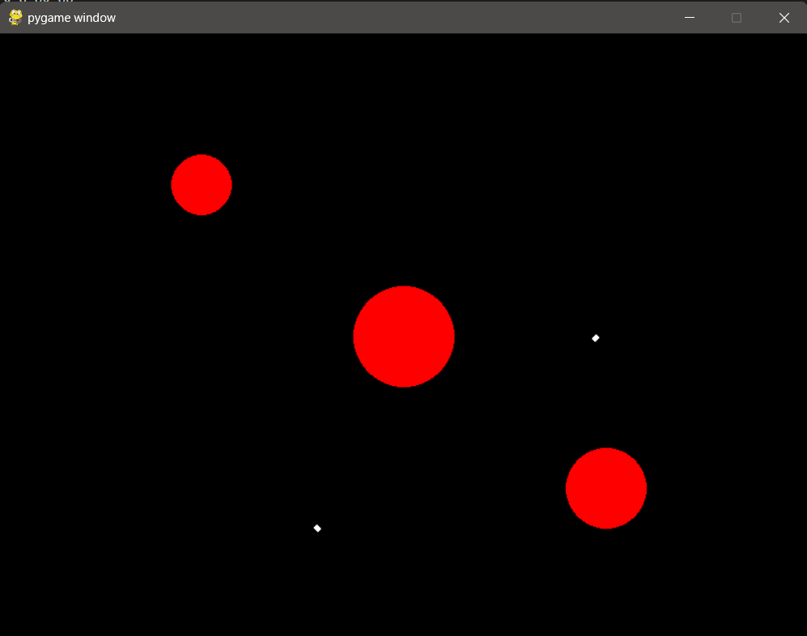

# Bio-Inspired Swarm Robotics Simulation

This project simulates bio-inspired flocking behavior in a swarm of robots using Python and Pygame. The robots (boids) exhibit alignment, cohesion, and separation behaviors, inspired by the movement of bird flocks.

## Files
- config.json: Configuration file with simulation parameters.
- environment.json: Environment setup with obstacles.
- initial_conditions.csv: Initial positions and velocities of the boids.
- boid.py: Implementation of the Boid class.
- simulation.py: Main simulation script.
- README.md: This file.

## How to Run the Simulation
1. Ensure you have Python and Pygame installed.
2. Place all the files in the same directory.
3. Run the simulation:
   python simulation.py

